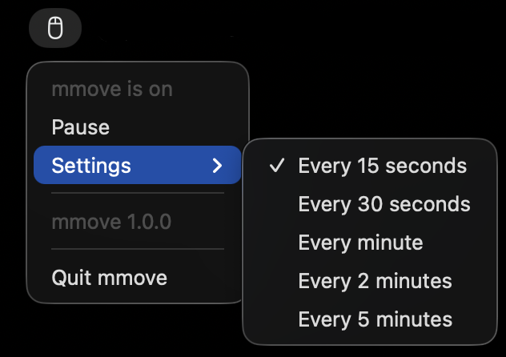

# mmove

A lightweight macOS menu bar utility that keeps your Mac from going idle by
periodically nudging the cursor a pixel or two — just enough to reset the
system idle timer. Useful during presentations, long reads, or any time you
want the machine to stay active without touching power settings.

- Lives only in the menu bar; no Dock icon, no windows.
- Never interferes while you're typing or using the mouse.
- Net cursor movement is zero — it always returns to where it was.
- No special permissions required.



## Usage

Click the mouse icon in the menu bar:

- **Pause / Resume** — toggle the activity timer.
- **Settings** — how often to nudge: every 15s, 30s, 60s (default), 2m, or 5m.
- **Quit mmove**.

## Build

Requires Xcode 16+ on macOS.

```bash
xcodebuild -project mmove.xcodeproj -scheme mmove -configuration Release build
```

Run tests:

```bash
xcodebuild test -project mmove.xcodeproj -scheme mmoveTests -destination 'platform=macOS'
```
